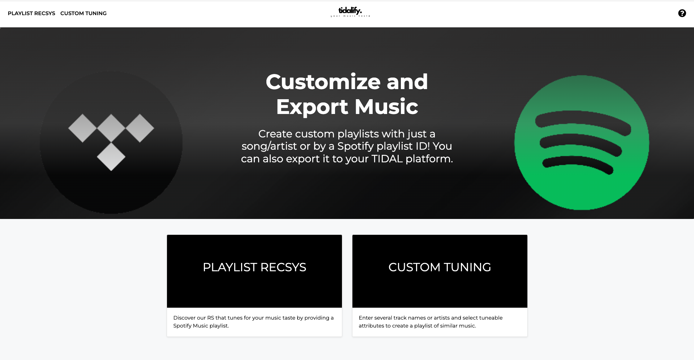
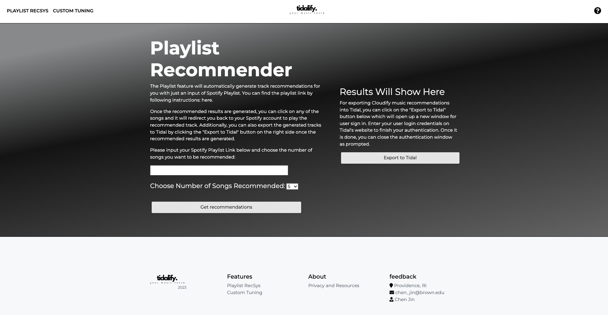
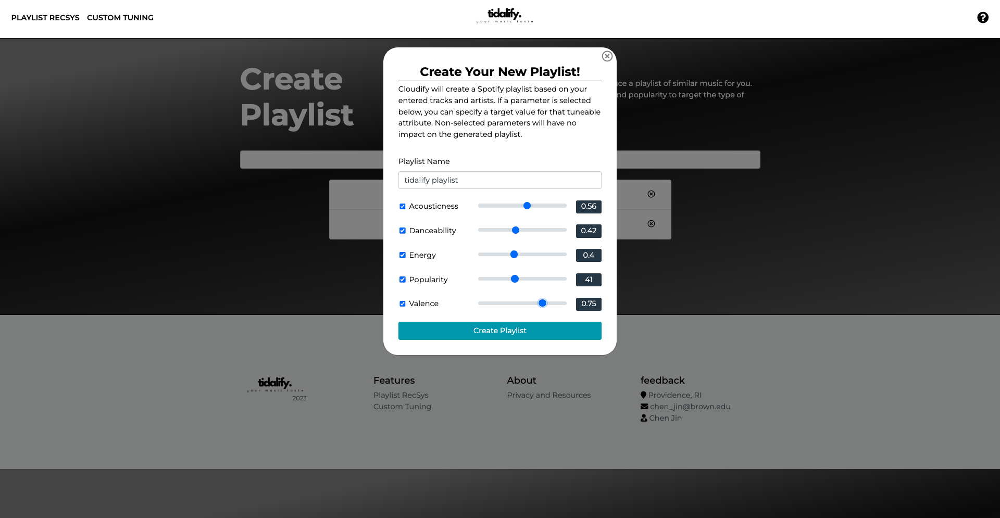
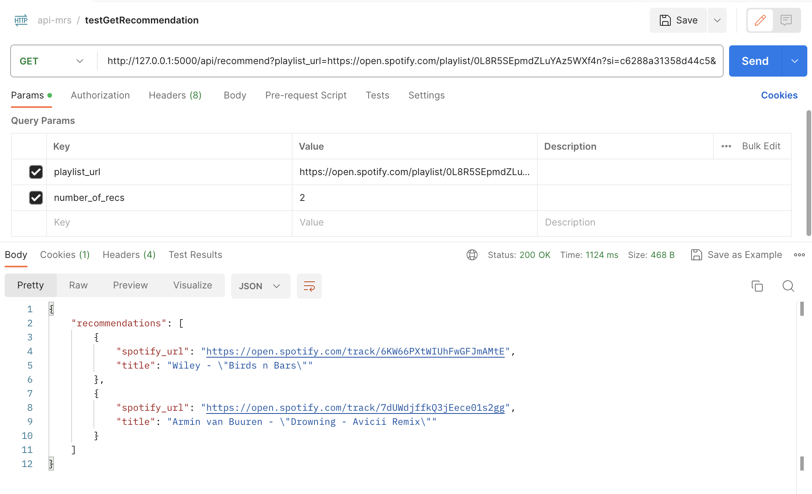
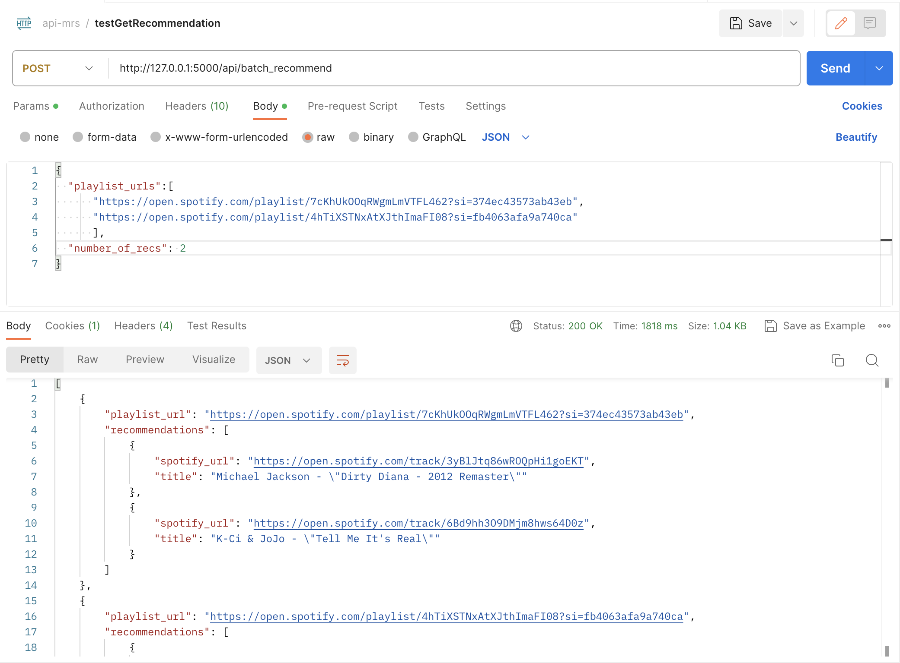
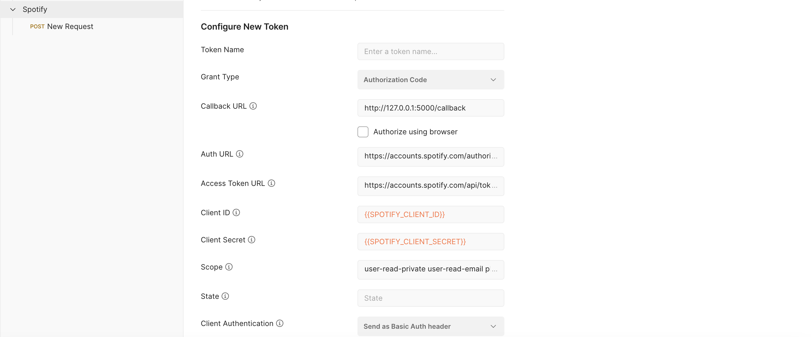
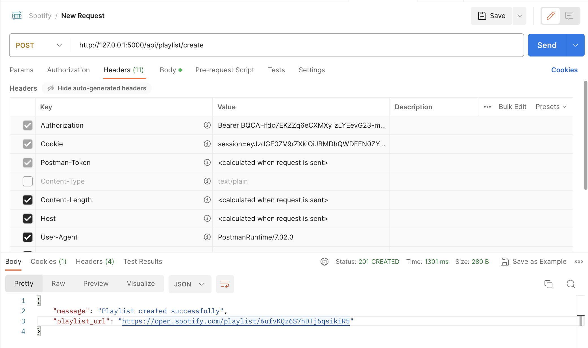

# Music Recommendation System API: Design and Implementation Document

### Web API Project Goals

The primary goal for implementing and extending the API functionalities of Tidalify is to develop endpoints where it gives users more flexibility and automation in getting recommendations and optionally into their preferred music streaming platforms. Specifically, APIs for single and batch music recommendations are added; development of a feature to create a new playlist on Spotify based on recommendations and ensuring usability and reliability through comprehensive unit tests.

## About Tidalify



A Flask project that offers two user features of which provides music recommendations to users based on Spotify music platform.

## Feature 1: Recommender System based on Content-Based Filtering Algorithm

- This project uses data from 2018 RecSys where 1 million playlist are provided as raw data set
- The Content-Based Filtering algorithm is referenced from the below framework workflow

  - **Part I**: [Extracting song data from Spotify’s API in Python](https://cameronwwatts.medium.com/extracting-song-data-from-the-spotify-api-using-python-b1e79388d50)
  - **Part II**: EDA and Clustering
  - **Part III**: [Building a Song Recommendation System with Spotify](https://medium.com/@enjui.chang/part-iii-building-a-song-recommendation-system-with-spotify-cf76b52705e7)
  - **Part IV**: [Deploying a Spotify Recommendation Model with Flask](https://medium.com/@yaremko.nazar/deploying-a-spotify-recommendation-model-with-flask-20007b76a20f)
  - **Part IV**: [Deploying a Spotify Recommendation Model with Flask](https://medium.com/@yaremko.nazar/deploying-a-spotify-recommendation-model-with-flask-20007b76a20f)

- Based on the prediction algorithm, recommended songs (under Spotify context) is fetched and gave users the ability to export into their own TIDAL music account
  - this is done through TIDAL's oauth2 protocol for user authorization. This project used the `tidalapi` API for user authorization. For further references: [`tidalapi` Documentation](https://pypi.org/project/tidalapi/)



## Feature 2: `/Recommend` API & User Tuning

For `Custom Tuning` feature, user have the ability to alter some of the audio features (12 sonic characteristics that are availble through Spotify API) for music recommendation. They can input their favorite songs or artists along with `auio_features` to generate a playlist recommended to them straight back in their Spotify playlist. This feature uses the Spotify's oauth protocol for user authentication.



## Information Page

For more information regarding the functionalities offered in this projuct, please refer to the `information` page. Since the application needs to access features within Spotify SDK, it requires certain user scopes. You can also revoke `permissions` from the link provided here.

## How to use

To clone the repository:

```sh
git clone https://github.com/chen-jin021/music-rs.git
```

To install the dependencies:

```
pip install -r requirements.txt
```

You will also need to set up your own environment variables for Spotify and Tidal. Variables like `CLIENT_ID`, `CLIENT_SECRET` are used for API calls to these two music platforms. For Spotify API acquisition, please aquire necessary credentials here [Spotify for developers](https://developer.spotify.com/) account. You will also need to set up the callback route within Spotify Developer Dashboard for rerouting. Simiarly for TIDAL.

## Extended API Design/Implementation

1. **Single Recommendation API (`/api/recommend`)**: This endpoint allows users to get music recommendations based on a single playlist URL. It accepts a `playlist_url` and an optional `number_of_recs` parameter, with validation to ensure the maximum number of recommendations does not exceed 40. Once the client supplies the correct parameters, our API calls the `recommend_from_playlist` function which utilizes content-based filtering algorithm to recommend songs to users based on their music preferences and return a json object that contains the results back to the user.
   
2. **Batch Recommendation API (`/api/batch_recommend`)**: This endpoint is designed to handle multiple playlist URLs at once, returning a set of recommendations for each playlist. Similar to the single recommendation API, it accepts a JSON payload containing `playlist_urls` and an optional `number_of_recs`.
   
3. **Playlist Creation API (`/api/playlist/create`)**: which interacts directly with Spotify's API to create a new playlist based on the recommendations. It requires a valid Spotify token for authentication and authorization. An example workflow for this API call follows that:
   - If the client is calling this API within Postman, they will first call the Spotify oauth2 API which gets the user token. In Postman, user can create an environment where the client_key and client_secrets are fed and let the user authenticate through Spotify to get the user_token.
     
   - From there, users are able to make API calls to our `/api/playlist/create` where the HTTP request header contains the `Authorization` token which is then used to make API calls to user's Spotify account and export recommended songs to user's profile.
     

### Implementation Details

- **Flask Framework**: Tidalify application is built using Flask, providing a robust structure for web app development.
- **Data Extraction**: The `extract` function processes the input playlist URL to retrieve relevant data for recommendation.
- **Recommendation Generation**: The `recommend_from_playlist` function uses the content-based filtering algorithm and takes the extracted data and generates recommendations using a predefined set of features and algorithms.
- **Spotify Integration**: For playlist creation, the system uses the Spotify API, requiring appropriate authentication and handling of Spotify-specific data formats.
- **Error Handling**: The API endpoint includes error handling to manage invalid inputs, external API failures, and unexpected exceptions.

## Repo Structure

```
├── README.md              <- The top-level README for developers using this project.
│
├── unit_tests             <- The unit tests for web API implementations
│
├── application            <- Code for model deployment and website design
│     ├── routes.py        <- Where routings and Web APIs are implemented
│
├── data1                  <- Pretrained data for model
│
├── venv                   <- Environment
│
└── requirements.txt       <- The requirements file for reproducing the analysis environment.
```
